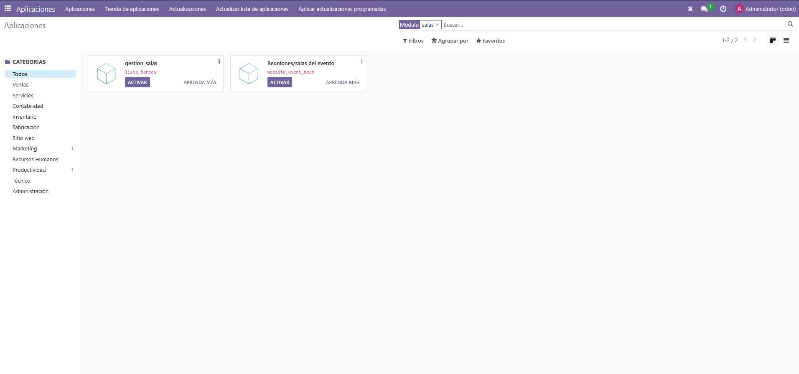
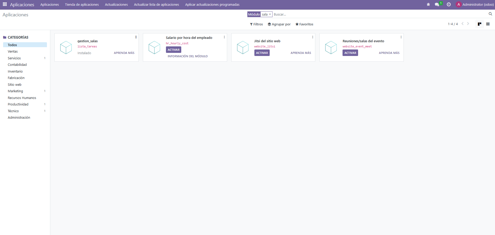
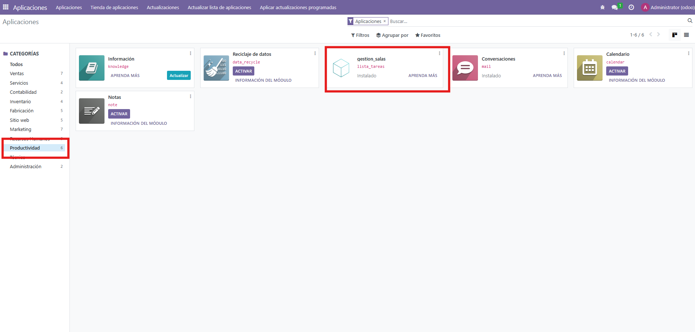

1 - Primero tenemos que poner este codigo en el archivo __manifest__.py
 ``` python
{
    'name': "gestion_salas",

    'summary': "Módulo para gestionar reservas de salas",

    'description': """
        Este módulo permite gestionar salas y sus reservas dentro de la empresa.
    """,

    'author': "Adrián",
    'website': "https://www.odoo.com",

    'category': 'Productivity',
    'version': '1.0',

    'depends': ['base'],

    'data': [
        'views/sala.xml',
        'views/menus.xml',
    ],
    
    'installable': True,
    'application': True,
}

 ````

2 - Segundo, creamos el archivo sala.py dentro de la carpeta models y ponemos este codigo.

```` python
from odoo import models, fields

class Sala(models.Model):
    _name = 'reserva.sala'
    _description = 'Sala de Reuniones'

    name = fields.Char(string='Nombre de la Sala', required=True)
    capacidad = fields.Integer(string='Capacidad')
    fecha_reserva = fields.Date(string='Fecha de Reserva')
    reservada = fields.Boolean(string='Reservada', default=False)
    comentarios = fields.Text(string='Comentarios')

````

3 - Tercero, creamos el archivo sala.xml dentro de la carpeta views y ponemos este codigo.

```` python
<odoo>
    <record id="view_sala_tree" model="ir.ui.view">
        <field name="name">sala.tree</field>
        <field name="model">reserva.sala</field>
        <field name="arch" type="xml">
            <tree>
                <field name="name"/>
                <field name="capacidad"/>
                <field name="fecha_reserva"/>
                <field name="reservada"/>
            </tree>
        </field>
    </record>

    <record id="view_sala_form" model="ir.ui.view">
        <field name="name">sala.form</field>
        <field name="model">reserva.sala</field>
        <field name="arch" type="xml">
            <form>
                <sheet>
                    <group>
                        <field name="name"/>
                        <field name="capacidad"/>
                        <field name="fecha_reserva"/>
                        <field name="reservada"/>
                        <field name="comentarios"/>
                    </group>
                </sheet>
            </form>
        </field>
    </record>
</odoo>
````

4 - Después, tenemos que crear el archivo menus.xml y ponemos el siguiente codigo.

```` python
<odoo>
    <record id="action_sala" model="ir.actions.act_window">
        <field name="name">Salas</field>
        <field name="res_model">reserva.sala</field>
        <field name="view_mode">tree,form</field>
    </record>
    <menuitem id="menu_gestion_salas" name="Gestión de salas"/>

    <menuitem id="menu_salas" name="Salas" parent="menu_gestion_salas"/>

    <menuitem id="menu_salas_disponibles"
              name="Salas Disponibles"
              parent="menu_salas"
              action="lista_tareas.action_sala"/>
    <menuitem id="menu_reservas" name="Reservas" parent="menu_gestion_salas"/>
    <menuitem id="menu_reservas_realizadas"
              name="Reservas realizadas"
              parent="menu_reservas"/>

</odoo>

````

5 - Ahora entramos en odoo como administrador, actualizamos la lista de aplicaciones que aparece arriba del todo en el menú, y buscamos nuestro módulo, en este caso, gestion_salas. Y lo activamos.
 

6 - Una vez le damos a Activar, vemos como está instalado
 

7 - Y si entramos en Aplicaciones --> Productividad , vemos como se encuentra ahi
 