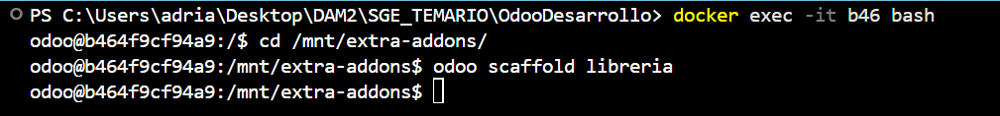
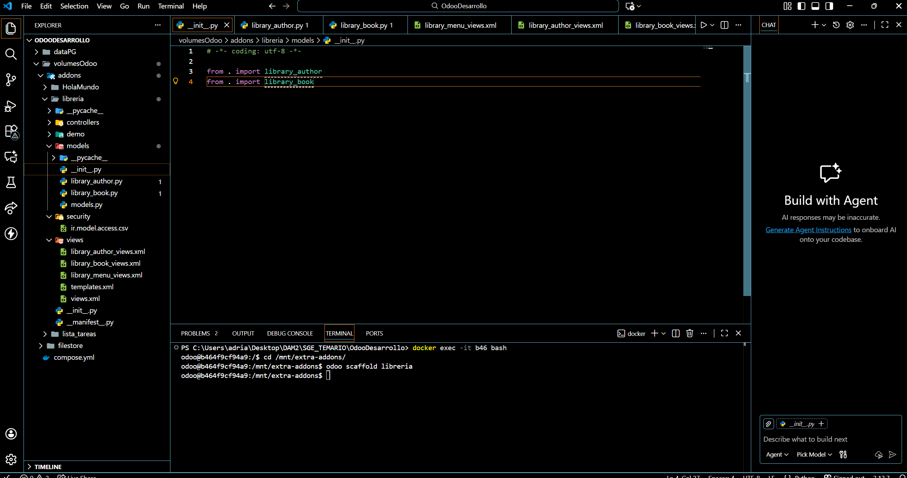
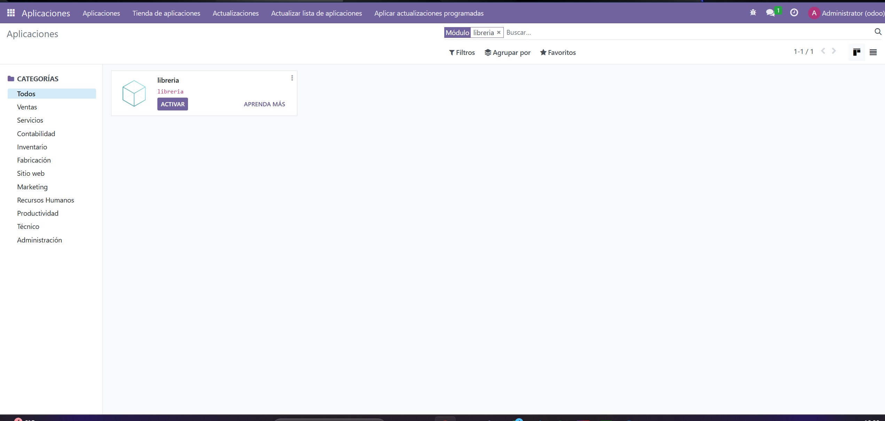

### PRACTICA

Antes de nada, vamos a la carpeta que creamos de odoo y ponemos estos comandos por terminal de Visual


Los numeros b46 son los 3 primeros numeros que aparecen en el docker cuando lo enciendes.

1 - En primer lugar, tenemos que crear los modelos y los views
 

2 - Ponemos las siguientes dos lines dentro del archivo models/__init__.py

```` python
from . import library_author
from . import library_book


````

3 - Después, ponemos las siguientes lineas dentro del archivo models/library_author.py

```` python
from odoo import models, fields

class LibraryAuthor(models.Model):
    _name = 'library.author'
    _description = 'Autor de libros'

    name = fields.Char(string="Nombre", required=True)
    birth_date = fields.Date(string="Fecha de nacimiento")
    biography = fields.Text(string="Biografía")
    books = fields.Text(string="Libros (One2many en futuro)")


````

4 - Ponemos las siguientes lineas dentro del archivo models/library_book.py

```` python 
from odoo import models, fields

class LibraryBook(models.Model):
    _name = 'library.book'
    _description = 'Libro'

    name = fields.Char(string="Nombre", required=True)
    author = fields.Char(string="Autor (FK en futuro)")
    publish_date = fields.Date(string="Fecha de publicación")
    isbn = fields.Char(string="ISBN")
    synopsis = fields.Text(string="Sinopsis")


````

5 - Ponemos esto en el archivo views/library_menu_views.xml

```` xml

<odoo>
    <menuitem id="library_menu" name="Biblioteca"/>

    <menuitem id="library_menu_authors" 
              name="Autores" 
              parent="library_menu"/>

    <menuitem id="library_menu_books" 
              name="Libros" 
              parent="library_menu"/>

</odoo>


````

6 - Ponemos las siguientes lineas dentro del archivo views/library_author_views.xml

```` xml
<odoo>

    <record id="view_library_author_tree" model="ir.ui.view">
        <field name="name">library.author.tree</field>
        <field name="model">library.author</field>
        <field name="arch" type="xml">
            <tree>
                <field name="name"/>
                <field name="birth_date"/>
            </tree>
        </field>
    </record>

    <record id="view_library_author_form" model="ir.ui.view">
        <field name="name">library.author.form</field>
        <field name="model">library.author</field>
        <field name="arch" type="xml">
            <form>
                <sheet>
                    <group>
                        <field name="name"/>
                        <field name="birth_date"/>
                        <field name="biography"/>
                        <field name="books"/>
                    </group>
                </sheet>
            </form>
        </field>
    </record>

    <record id="action_library_author" model="ir.actions.act_window">
        <field name="name">Autores</field>
        <field name="res_model">library.author</field>
        <field name="view_mode">tree,form</field>
    </record>

    <menuitem id="library_menu_authors_action"
              parent="library_menu_authors"
              action="action_library_author"/>

</odoo>


````

7 - Ponemos estas lineas en el archivo views/library_book_views.xml

```` xml
<odoo>

    <record id="view_library_book_tree" model="ir.ui.view">
        <field name="name">library.book.tree</field>
        <field name="model">library.book</field>
        <field name="arch" type="xml">
            <tree>
                <field name="name"/>
                <field name="author"/>
                <field name="publish_date"/>
            </tree>
        </field>
    </record>

    <record id="view_library_book_form" model="ir.ui.view">
        <field name="name">library.book.form</field>
        <field name="model">library.book</field>
        <field name="arch" type="xml">
            <form>
                <sheet>
                    <group>
                        <field name="name"/>
                        <field name="author"/>
                        <field name="publish_date"/>
                        <field name="isbn"/>
                        <field name="synopsis"/>
                    </group>
                </sheet>
            </form>
        </field>
    </record>

    <record id="action_library_book" model="ir.actions.act_window">
        <field name="name">Libros</field>
        <field name="res_model">library.book</field>
        <field name="view_mode">tree,form</field>
    </record>

    <menuitem id="library_menu_books_action"
              parent="library_menu_books"
              action="action_library_book"/>

</odoo>


````

8 - Y dentro del archivo security/ir.model.access.csv ponemos estas dos lineas:

```` csv
access_library_author,access_library_author,model_library_author,base.group_user,1,1,1,1
access_library_book,access_library_book,model_library_book,base.group_user,1,1,1,1

````

9 - Y en el archivo __manifest__.py ponemos esto

```` python
{
    'name': "library_management",
    'version': '1.0',
    'depends': ['base'],
    'data': [
        'security/ir.model.access.csv',
        'views/library_menu_views.xml',
        'views/library_author_views.xml',
        'views/library_book_views.xml',
    ],
}


````

    10 - Ahora nos vamos a odoo. Entramos como Administrador y nos vamos a Aplicaciones. Le damos a Actualizar lista de aplicaciones --> Buscamos el  modelo de libreria y vemos cómo nos aparece.



Después le damos a Activar.


