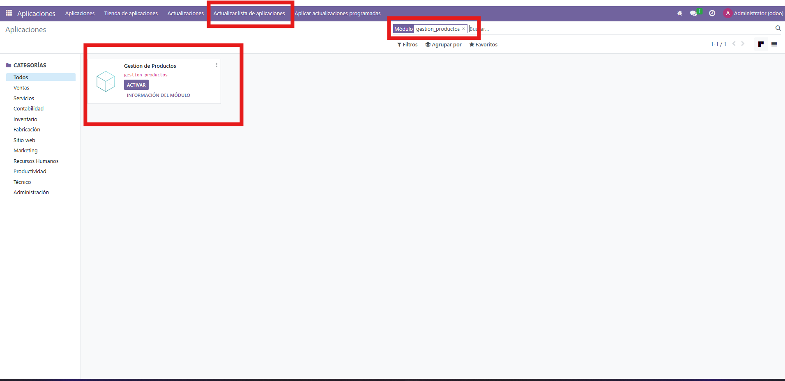
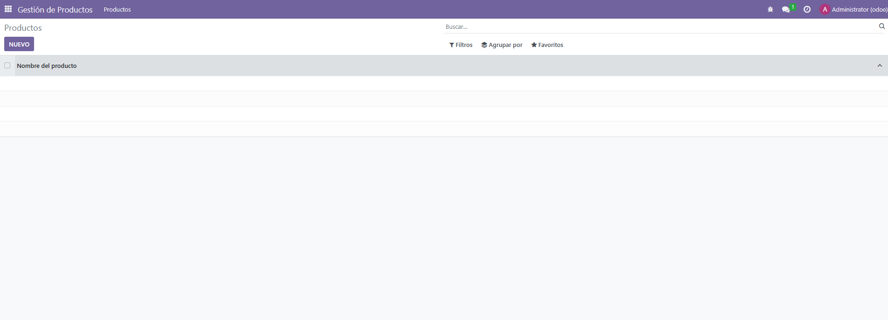
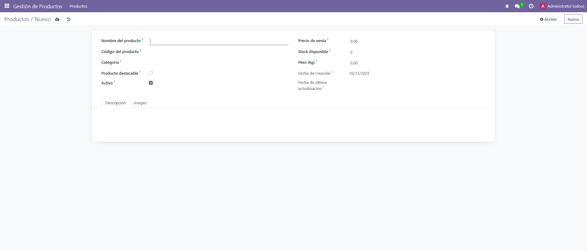
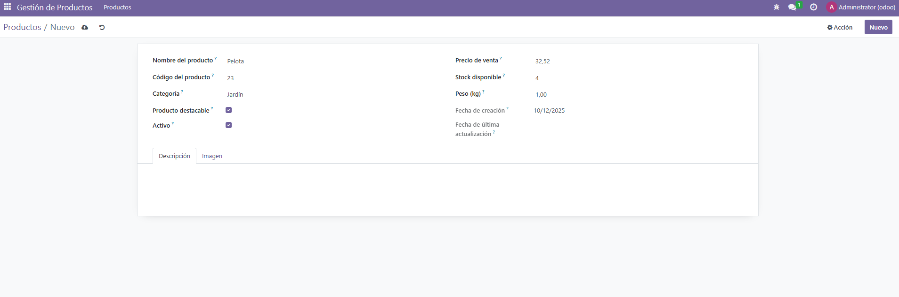
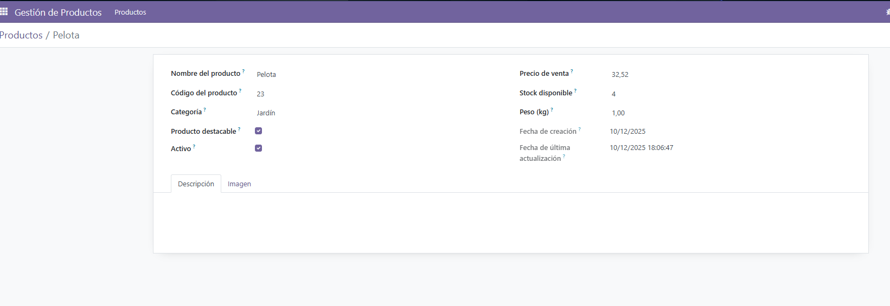

1 - Primero tenemos que poner este codigo en el archivo __manifest__.py
 ``` python
{
    'name': "Gestion de Productos",
    'summary': 'Módulo para gestionar la los productos',
    'author': "Adrián",
    'category': 'Inventario',
    'version': '0.1',
    'depends': ['base'],
    'data': [
    'security/ir.model.access.csv',
    'views/producto_menu.xml',
    'views/producto_view.xml',
],
    'installable': True,
    'application': True,
}

````

2 - Ahora vamos a models/__init__.py y tenemos que tener puesto esto en el archivo

```` python
from . import producto
````

3 - Ahora tenemos que crear un archivo en models y este archivo en este caso se llamará producto.py y ponemos:

```` python

from odoo import models, fields, api
from datetime import date

class Producto(models.Model):
    _name = 'gestion.producto'
    _description = 'Gestión de Productos'

    name = fields.Char(string="Nombre del producto", required=True)
    descripcion = fields.Text(string="Descripción")
    codigo = fields.Char(string="Código del producto", required=True)
    imagen = fields.Binary(string="Imagen del producto")

    categoria = fields.Selection([
        ('jardin', 'Jardín'),
        ('hogar', 'Hogar'),
        ('electro', 'Electrodomésticos')
    ], string="Categoría")

    destacable = fields.Boolean(string="Producto destacable", default=False)

    precio_venta = fields.Float(string="Precio de venta")
    stock = fields.Integer(string="Stock disponible")

    fecha_creacion = fields.Date(
        string="Fecha de creación",
        default=fields.Date.today
    )
    fecha_ultima_actualizacion = fields.Datetime(
        string="Fecha de última actualización",
        readonly=True
    )

    activo = fields.Boolean(string="Activo", default=True)
    peso = fields.Float(string="Peso (kg)", digits=(6, 2))

    @api.model
    def create(self, values):
        """Asigna la fecha de actualización al crear"""
        values['fecha_ultima_actualizacion'] = fields.Datetime.now()
        return super(Producto, self).create(values)

    def write(self, values):
        """Actualiza la fecha al modificar"""
        values['fecha_ultima_actualizacion'] = fields.Datetime.now()
        return super(Producto, self).write(values)


````

4 - Ahora creamos el archivo producto_view.xml dentro de views. Y ponemos
lo siguiente

```` xml

<?xml version="1.0" encoding="UTF-8"?>
<odoo>

    <record id="action_gestion_productos" model="ir.actions.act_window">
        <field name="name">Productos</field>
        <field name="res_model">gestion.producto</field>
        <field name="view_mode">tree,form</field>
    </record>

    <menuitem id="menu_gestion_productos"
          parent="menu_gestion_productos_root"
          action="action_gestion_productos"/>


    <record id="view_form_producto" model="ir.ui.view">
        <field name="name">gestion.producto.form</field>
        <field name="model">gestion.producto</field>
        <field name="arch" type="xml">
            <form string="Producto">
                <sheet>
                    <group>
                        <group>
                            <field name="name"/>
                            <field name="codigo"/>
                            <field name="categoria"/>
                            <field name="destacable"/>
                            <field name="activo"/>
                        </group>

                        <group>
                            <field name="precio_venta"/>
                            <field name="stock"/>
                            <field name="peso"/>
                            <field name="fecha_creacion" readonly="1"/>
                            <field name="fecha_ultima_actualizacion" readonly="1"/>
                        </group>
                    </group>

                    <notebook>
                        <page string="Descripción">
                            <field name="descripcion"/>
                        </page>

                        <page string="Imagen">
                            <field name="imagen" widget="image"/>
                        </page>
                    </notebook>

                </sheet>
            </form>
        </field>
    </record>

</odoo>


````


5 - Creamos el archivo producto_menu.xml con el siguiente contenido

```` xml

<?xml version="1.0" encoding="UTF-8"?>
<odoo>
    <menuitem id="menu_gestion_productos_root"
              name="Gestión de Productos"
              sequence="15"/>

    <menuitem id="menu_gestion_productos"
              name="Productos"
              parent="menu_gestion_productos_root"/>
</odoo>

````

6 - En security/ir.model.access.csv tienes que tener:

```` csv
id,name,model_id:id,group_id:id,perm_read,perm_write,perm_create,perm_unlink
access_gestion_producto,access_gestion_producto,model_gestion_producto,base.group_user,1,1,1,1

````


7 - Ahora entramos en odoo como administrador, activamos modo desarrollador, actualizamos la lista de aplicaciones que aparece arriba del todo en el menú, y buscamos nuestro módulo. Y lo activamos.
 

8 - Cuando entramos en Gestion de Productos, tenemos esta pantalla
 

9 - Ahora le damos a Nuevo y nos aparece lo siguiente:
 
 Vamos a crear uno nuevo

10 - Cuando creamos uno nuevo, tenemos que darle al Boton nuevo que aparece arriba a la derecha
 

11 - Cuando creamos el producto, cuando nos vamos a la anterior pantalla, nos aparece el producto creado


12 - Y si le damos a Pelota nos aparece la informacion del producto



