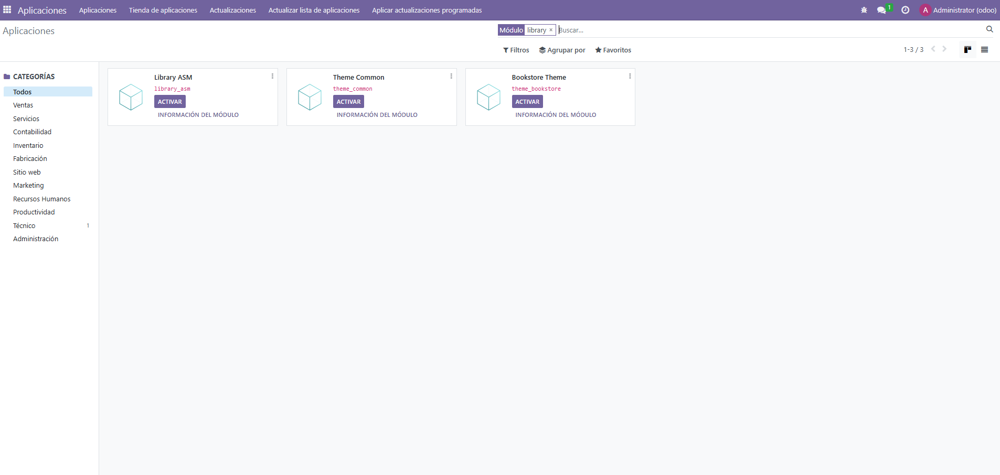
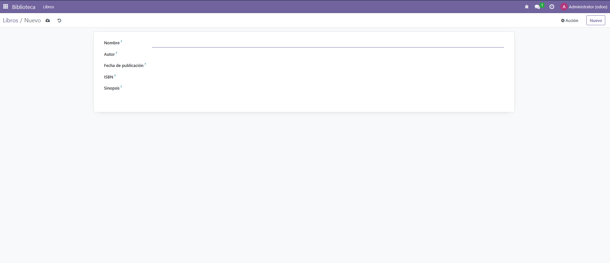
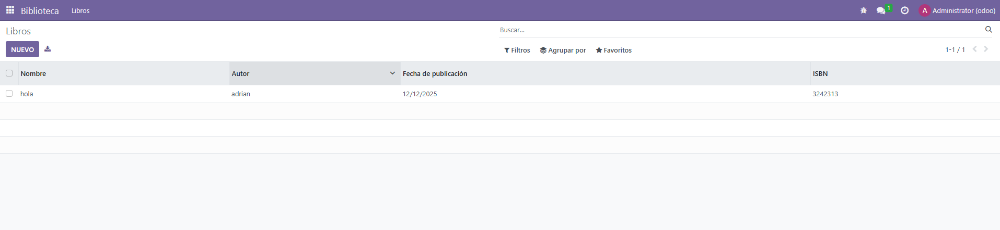

1 - Primero tenemos que hacer estos comandos


2 - Luego ponemos este codigo en el __manifest__.py del modelo

```` python
{
    'name': 'Library ASM',
    'version': '1.0',
    'category': 'Educacion',
    'summary': 'Gestión de biblioteca',
    'depends': ['base'],
    'data': [
        'security/ir.model.access.csv',
        'views/book_views.xml',
        'views/author_views.xml',
        'views/partner_views.xml',
        'views/library_menus.xml',
    ],
    'installable': True,
    'application': True,
}

````

3 - Ahora nos vamos a models/book.py y ponemos este codigo

```` python 

from odoo import models, fields

class LibraryBook(models.Model):
    _name = 'library.book'
    _description = 'Libro'

    name = fields.Char(string='Título', required=True)

    author_id = fields.Many2one(
        'library.author',
        string='Autor'
    )

    genre = fields.Selection(
        [
            ('novela', 'Novela'),
            ('drama', 'Drama'),
            ('scifi', 'Ciencia Ficción'),
            ('misterio', 'Misterio'),
            ('terror', 'Terror'),
            ('historico', 'Histórico'),
        ],
        string='Género'
    )

    partner_ids = fields.Many2many(
        'library.partner',
        string='Socios'
    )


`````

4 - Ahora vamos a models/author.py y ponemos lo siguiente: 
 
```` python

from odoo import models, fields

class LibraryAuthor(models.Model):
    _name = 'library.author'
    _description = 'Autor'

    name = fields.Char(string='Nombre', required=True)

    country_id = fields.Many2one(
        'res.country',
        string='País de origen'
    )

    book_ids = fields.One2many(
        'library.book',
        'author_id',
        string='Libros escritos'
    )


````

5 - Vamos a models/partner.py y ponemos: 

```` python

from odoo import models, fields

class LibraryPartner(models.Model):
    _name = 'library.partner'
    _description = 'Socio'

    name = fields.Char(string='Nombre', required=True)
    phone = fields.Char(string='Teléfono')

    book_ids = fields.Many2many(
        'library.book',
        string='Libros prestados'
    )


````

6 - Vamos a las vistas, en primer lugar vamos a views/book_views.xml y ponemos lo siguiente: 

```` xml

<odoo>
    <record id="view_library_book_tree" model="ir.ui.view">
        <field name="name">library.book.tree</field>
        <field name="model">library.book</field>
        <field name="arch" type="xml">
            <tree>
                <field name="name"/>
                <field name="author_id"/>
                <field name="genre"/>
            </tree>
        </field>
    </record>

    <record id="view_library_book_form" model="ir.ui.view">
        <field name="name">library.book.form</field>
        <field name="model">library.book</field>
        <field name="arch" type="xml">
            <form>
                <sheet>
                    <group>
                        <field name="name"/>
                        <field name="author_id"/>
                        <field name="genre"/>
                        <field name="partner_ids" widget="many2many_tags"/>
                    </group>
                </sheet>
            </form>
        </field>
    </record>
</odoo>


````

7 - Ahora vamos a security/ir.model.access.csv y ponemos: 

```` csv

id,name,model_id:id,group_id:id,perm_read,perm_write,perm_create,perm_unlink
access_library_book,library.book,model_library_book,,1,1,1,1
access_library_author,library.author,model_library_author,,1,1,1,1
access_library_partner,library.partner,model_library_partner,,1,1,1,1


````

8 - Añadimos esto en los archivos author_views.xml y partner_views.xml que se encuentran en la carpeta views

```` xml
<odoo>
</odoo>


````

9 - Ahora creamos library_menu.xml en la carpeta views.

```` xml

<odoo>

    <record id="action_library_book" model="ir.actions.act_window">
        <field name="name">Libros</field>
        <field name="res_model">library.book</field>
        <field name="view_mode">tree,form</field>
    </record>

    <menuitem
        id="menu_library_root"
        name="Biblioteca"
        sequence="10"
    />

    <menuitem
        id="menu_library_books"
        name="Libros"
        parent="menu_library_root"
        action="action_library_book"
        sequence="10"
    />

</odoo>


````

10 - Ahora vamos a Odoo, activamos el modo desarrollador en ajuste, actualizamos la lista de aplicaciones y despues nos vamos a Aplicaciones en el menu de la izquierda arriba y en el buscador ponemos: library. Y como podemos comprobar en la captura, nos aparece el modelo que hemos creado. library_asm. Ahora tenemos que darle a Activar


11 - Aqui vemos como ya se nos ha creado en el menu. Como podemos comprobar, hay otra Biblioteca de otro ejercicio anterior que hicimos un dia, pero el que hemos creado hoy el segundo que está entre un recuadro rojo.


12 - Si pinchamos en Libros, nos aparece esta ventana


13 - Y cuando lo creamos, nos aparece esto 
