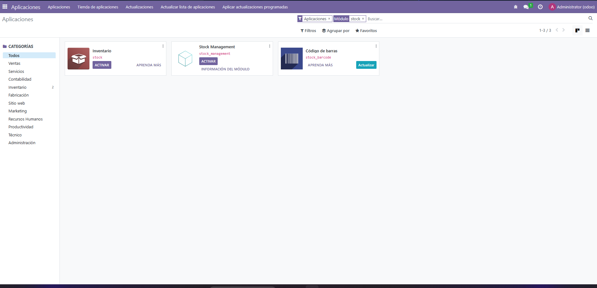
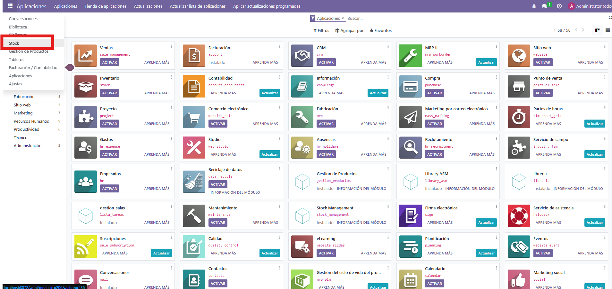
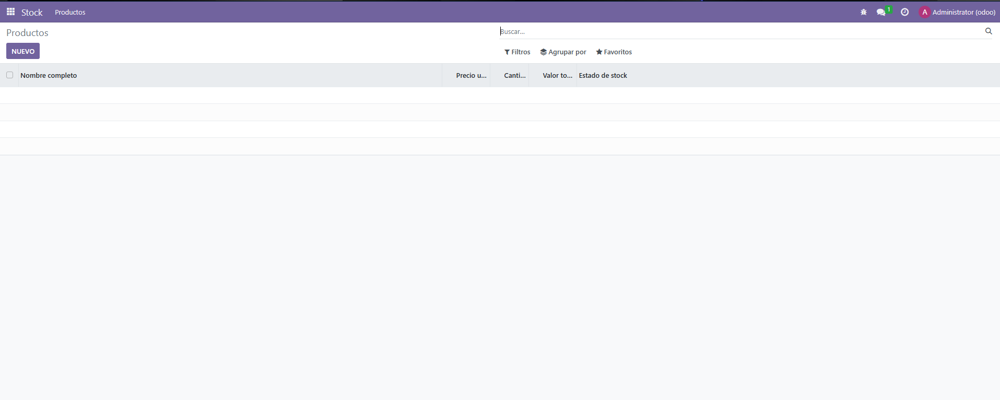
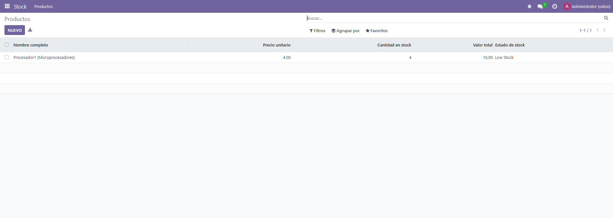

1 - En primer lugar, vamos a __manifest__.py y ponemos: 

```` python

{
    'name': 'Stock Management',
    'version': '1.0',
    'category': 'Inventario',
    'summary': 'Gestión de productos con campos calculados y restricciones',
    'depends': ['base'],
    'data': [
        'security/ir.model.access.csv',
        'views/stock_product_views.xml',
        'views/stock_menus.xml',
    ],
    'application': True,
}


````

2 - Ahora creamos en la carpeta models el archivo stock_producto.py y ponemos lo siguiente: 

```` python

from odoo import models, fields, api
from odoo.exceptions import ValidationError

class StockProduct(models.Model):
    _name = 'stock.product'
    _description = 'Producto en stock'

    #CAMPOS

    name = fields.Char(string='Nombre', required=True)

    category = fields.Selection(
        [
            ('micro', 'Microprocesadores'),
            ('gpu', 'Tarjetas gráficas'),
            ('ram', 'Memoria RAM'),
            ('storage', 'Almacenamiento'),
        ],
        string='Categoría',
        required=True
    )

    price = fields.Float(string='Precio unitario', required=True)

    quantity = fields.Integer(string='Cantidad en stock', default=0)

    minimum_quantity = fields.Integer(string='Cantidad mínima', default=0)

    total_value = fields.Float(
        string='Valor total',
        compute='_compute_total_value',
        store=True
    )

    stock_status = fields.Selection(
        [
            ('normal', 'Normal'),
            ('low', 'Low Stock'),
        ],
        string='Estado de stock',
        compute='_compute_stock_status',
        store=True
    )

    full_name = fields.Char(
        string='Nombre completo',
        compute='_compute_full_name',
        store=True
    )

    #CAMPOS CALCULADOS

    @api.depends('price', 'quantity')
    def _compute_total_value(self):
        for record in self:
            record.total_value = record.price * record.quantity

    @api.depends('quantity', 'minimum_quantity')
    def _compute_stock_status(self):
        for record in self:
            if record.quantity < record.minimum_quantity:
                record.stock_status = 'low'
            else:
                record.stock_status = 'normal'

    @api.depends('name', 'category')
    def _compute_full_name(self):
        category_dict = dict(self._fields['category'].selection)
        for record in self:
            if record.name and record.category:
                record.full_name = f"{record.name} ({category_dict.get(record.category)})"
            else:
                record.full_name = record.name or ''

    #RESTRICCIONES SQL

    _sql_constraints = [
        (
            'unique_product_name',
            'UNIQUE(name)',
            'El nombre del producto debe ser único'
        ),
        (
            'quantity_positive',
            'CHECK(quantity >= 0)',
            'La cantidad en stock no puede ser negativa'
        ),
    ]

    #RESTRICCIONES PYTHON

    @api.constrains('price')
    def _check_price(self):
        for record in self:
            if record.price <= 0:
                raise ValidationError('El precio debe ser mayor que 0')

    @api.constrains('quantity')
    def _check_quantity(self):
        for record in self:
            if record.quantity < 0:
                raise ValidationError('La cantidad no puede ser negativa')

    @api.constrains('total_value')
    def _check_total_value(self):
        for record in self:
            if record.total_value > 100000:
                raise ValidationError(
                    'El valor total del stock no puede superar 100000 unidades monetarias'
                )


````

3 - En models/init.py ponemos: 

```` python

from . import stock_product


````

4 - En la carpeta security/ir.model.access.csv ponemos: 

```` csv

id,name,model_id:id,group_id:id,perm_read,perm_write,perm_create,perm_unlink
access_stock_product,stock.product,model_stock_product,,1,1,1,1


````

5 - Ahora creamos el archivo stock_product_views.xml en la carpeta views y ponemos: 

```` xml

<odoo>

    <record id="view_stock_product_tree" model="ir.ui.view">
        <field name="name">stock.product.tree</field>
        <field name="model">stock.product</field>
        <field name="arch" type="xml">
            <tree>
                <field name="full_name"/>
                <field name="price"/>
                <field name="quantity"/>
                <field name="total_value"/>
                <field name="stock_status"/>
            </tree>
        </field>
    </record>

    <record id="view_stock_product_form" model="ir.ui.view">
        <field name="name">stock.product.form</field>
        <field name="model">stock.product</field>
        <field name="arch" type="xml">
            <form>
                <sheet>
                    <group>
                        <field name="name"/>
                        <field name="category"/>
                        <field name="price"/>
                        <field name="quantity"/>
                        <field name="minimum_quantity"/>
                        <field name="total_value" readonly="1"/>
                        <field name="stock_status" readonly="1"/>
                        <field name="full_name" readonly="1"/>
                    </group>
                </sheet>
            </form>
        </field>
    </record>

</odoo>


````

6 - Ahora creamos el archivo views/stock_menus.xml para que se pueda ver el menu en odoo.

```` xml

<odoo>

    <record id="action_stock_product" model="ir.actions.act_window">
        <field name="name">Productos</field>
        <field name="res_model">stock.product</field>
        <field name="view_mode">tree,form</field>
    </record>

    <menuitem
        id="menu_stock_root"
        name="Stock"
        sequence="10"
    />

    <menuitem
        id="menu_stock_products"
        name="Productos"
        parent="menu_stock_root"
        action="action_stock_product"
        sequence="10"
    />

</odoo>


````

7 - Ahora vamos a odoo y buscamos stock y podemos comprobar que nos aparece. Ahora Activamos


8 - Y vemos que nos aparece en el menu, ahora entramos dentro


9 - Vemos que nos aparece correctamente, y vamos a crear uno nuevo a ver qué nos aparece


10 - Creamos el producto con estos datos


11 - Y vemos que nos aparece correctamente
