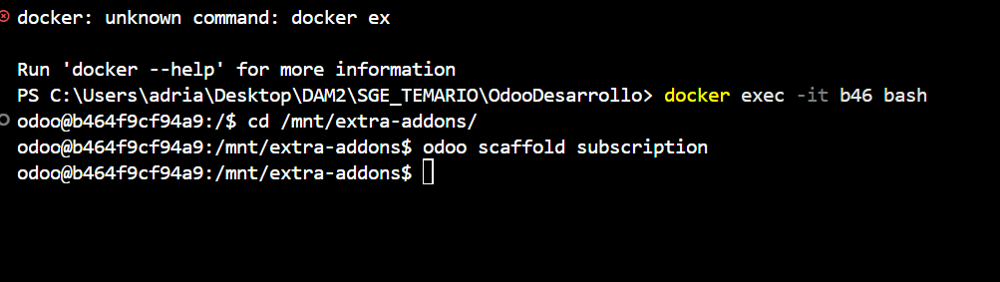
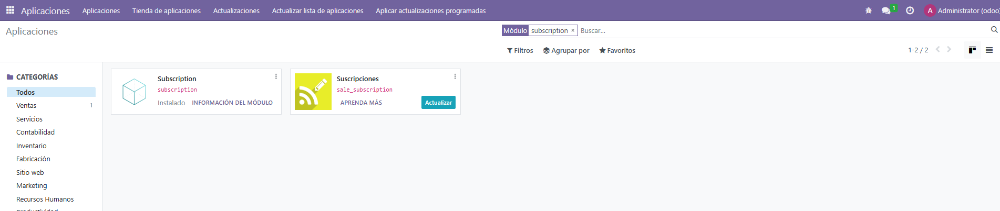
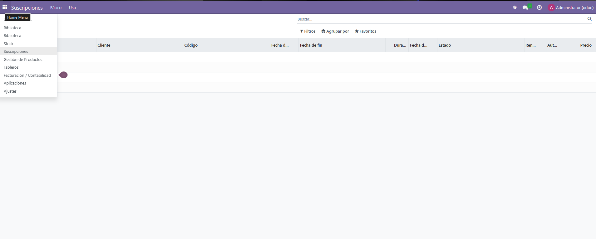
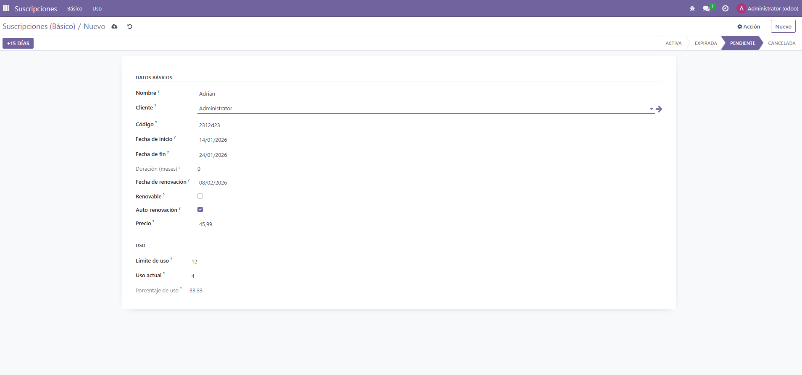
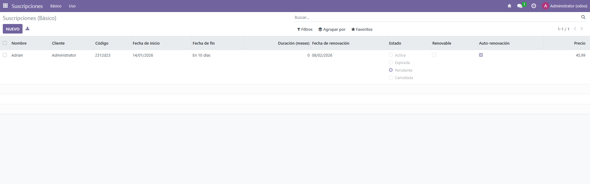
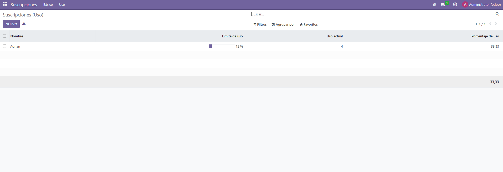

1 - En primer lugar, tenemos que crear lo de subscripcion de la siguiente manera: 


2 - En segundo lugar, ponemos esto en EL __manifest__.py
```` python
{
    'name': "Subscription",

    'summary': "Gestión de Subscipciones",
    'author': "My Company",
    'category': 'Uncategorized',
    'version': '0.1',
    'depends': ['base'],
    'data': [
        'security/ir.model.access.csv',
        'views/views.xml',
        "views/subscription_views.xml",
        'views/templates.xml',
    ],
    'installable': True,
    'application': True,

    'demo': [
        'demo/demo.xml',
    ],
}

````

3- En tercer lugar, tenemos que añadir lo siguiente en models/subscription.py

```` python
from odoo import models, fields, api
from datetime import timedelta

class SubscriptionManagement(models.Model):
    _name = "subscription.management"
    _description = "Subscription Management"

    name = fields.Char(string="Nombre", required=True)
    customer_id = fields.Many2one("res.partner", string="Cliente", required=True)
    subscription_code = fields.Char(string="Código", required=True)
    start_date = fields.Date(string="Fecha de inicio", required=True)
    end_date = fields.Date(string="Fecha de fin")
    duration_months = fields.Integer(string="Duración (meses)", compute="_compute_duration", store=True)
    renewal_date = fields.Date(string="Fecha de renovación")
    status = fields.Selection([
        ("active", "Activa"),
        ("expired", "Expirada"),
        ("pending", "Pendiente"),
        ("cancelled", "Cancelada")
    ], string="Estado", default="pending")
    is_renewable = fields.Boolean(string="Renovable")
    auto_renewal = fields.Boolean(string="Auto-renovación")
    price = fields.Float(string="Precio")


    usage_limit = fields.Integer(string="Límite de uso")
    current_usage = fields.Integer(string="Uso actual")
    use_percent = fields.Float(string="Porcentaje de uso", compute="_compute_use_percent", store=True)


    @api.depends("start_date", "end_date")
    def _compute_duration(self):
        for rec in self:
            if rec.start_date and rec.end_date:
                delta = rec.end_date - rec.start_date
                rec.duration_months = int(delta.days / 30)
            else:
                rec.duration_months = 0

    @api.depends("usage_limit", "current_usage")
    def _compute_use_percent(self):
        for rec in self:
            if rec.usage_limit:
                rec.use_percent = (rec.current_usage / rec.usage_limit) * 100
            else:
                rec.use_percent = 0

    def action_add_15_days(self):
        for rec in self:
            if rec.end_date:
                rec.end_date = rec.end_date + timedelta(days=15)


````

4. En cuarto lugar, añadimos lo siguiente en ir.model.access.csv

```` python

id,name,model_id:id,group_id:id,perm_read,perm_write,perm_create,perm_unlink
access_subscription_user,access_subscription_user,model_subscription_management,,1,1,1,1

````

5. En quinto lugar, nos vamos a las vistas y creamos el archivo subscription_views y ponemos: 

```` xml

<odoo>

    <record id="view_subscription_tree_basic" model="ir.ui.view">
        <field name="name">subscription.tree.basic</field>
        <field name="model">subscription.management</field>
        <field name="arch" type="xml">
            <tree string="Suscripciones - Básico"
                  decoration-danger="status == 'expired'"
                  decoration-warning="status == 'cancelled'"
                  limit="15">

                <field name="name"/>
                <field name="customer_id"/>
                <field name="subscription_code"/>
                <field name="start_date"/>
                <field name="end_date" widget="remaining_days"/>
                <field name="duration_months"/>
                <field name="renewal_date"/>
                <field name="status" widget="radio"/>
                <field name="is_renewable"/>
                <field name="auto_renewal"/>
                <field name="price" attrs="{'invisible': [('status','=','cancelled')]}"/>

            </tree>
        </field>
    </record>


    <record id="view_subscription_tree_usage" model="ir.ui.view">
        <field name="name">subscription.tree.usage</field>
        <field name="model">subscription.management</field>
        <field name="arch" type="xml">
            <tree string="Suscripciones - Uso"
                  decoration-danger="status == 'expired'"
                  decoration-warning="status == 'cancelled'"
                  limit="15">

                <field name="name"/>
                <field name="usage_limit" widget="progressbar"/>
                <field name="current_usage"/>
                <field name="use_percent"
                       avg="Media de uso"
                       decoration-danger="use_percent &gt;= 80"/>

            </tree>
        </field>
    </record>


    <record id="view_subscription_form" model="ir.ui.view">
        <field name="name">subscription.form</field>
        <field name="model">subscription.management</field>
        <field name="arch" type="xml">
            <form string="Suscripción">

                <header>
                    <button name="action_add_15_days"
                            type="object"
                            string="+15 días"
                            class="btn-primary"/>
                    <field name="status" widget="statusbar"/>
                </header>

                <sheet>
                    <group string="Datos básicos">
                        <field name="name"/>
                        <field name="customer_id"/>
                        <field name="subscription_code"/>
                        <field name="start_date"/>
                        <field name="end_date"/>
                        <field name="duration_months" readonly="1"/>
                        <field name="renewal_date"/>
                        <field name="is_renewable"/>
                        <field name="auto_renewal"/>
                        <field name="price"/>
                    </group>

                    <group string="Uso">
                        <field name="usage_limit"/>
                        <field name="current_usage"/>
                        <field name="use_percent" readonly="1"/>
                    </group>
                </sheet>

            </form>
        </field>
    </record>


    <record id="action_subscription_basic" model="ir.actions.act_window">
        <field name="name">Suscripciones (Básico)</field>
        <field name="res_model">subscription.management</field>
        <field name="view_mode">tree,form</field>
        <field name="view_id" ref="view_subscription_tree_basic"/>
    </record>

    <record id="action_subscription_usage" model="ir.actions.act_window">
        <field name="name">Suscripciones (Uso)</field>
        <field name="res_model">subscription.management</field>
        <field name="view_mode">tree,form</field>
        <field name="view_id" ref="view_subscription_tree_usage"/>
    </record>

    <menuitem id="menu_subscription_root" name="Suscripciones"/>

    <menuitem id="menu_subscription_basic"
              name="Básico"
              parent="menu_subscription_root"
              action="action_subscription_basic"/>

    <menuitem id="menu_subscription_usage"
              name="Uso"
              parent="menu_subscription_root"
              action="action_subscription_usage"/>

</odoo>


````

6. Buscamos subscription en Aplicaciones y lo Activamos


7. Aqui podemos ver lo que hay dentro de Suscripciones


8. Si metemos estos datos y le damos a Guardar


9. Nos aparece esto, y aparece como Pendiente


10. Y si nos vamos a Uso nos aparece esto:



