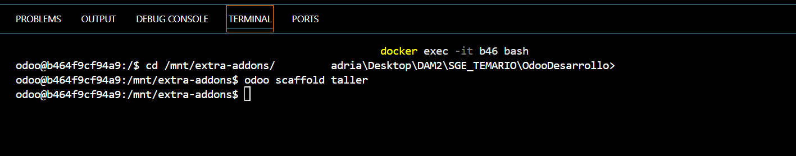
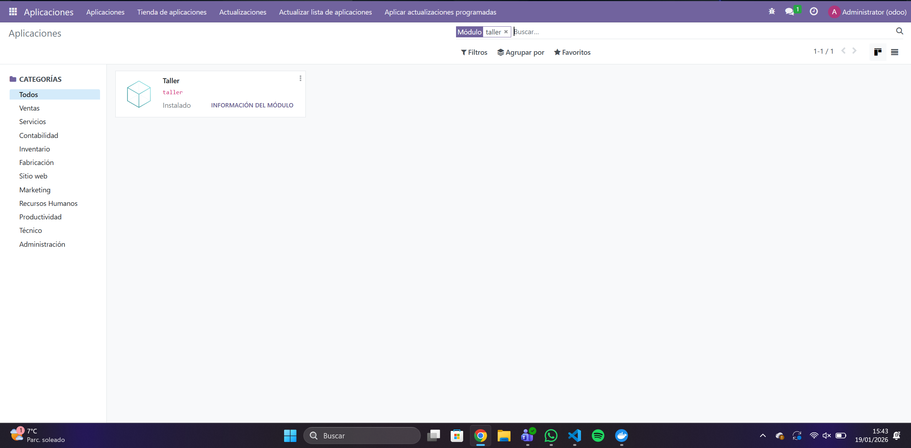
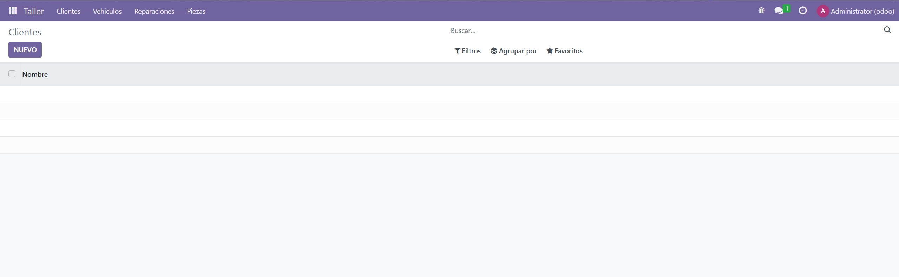

1 - En primer lugar, tenemos que crear lo de taller de la siguiente manera: 


2 - ahora nos vamos a __init__.py y tenemos que tener este dentro del archivo:

```` python

from . import controllers
from . import models

````

3 - Despues, nos vamos al manifest y ponemos lo siguiente:

```` python

{
    'name': "Taller",

    'summary': "Gestión de Taller Mecánico",
    'author': "My Company",
    'category': 'Uncategorized',
    'version': '0.1',
    'depends': ['base'],
    'data': [
        'security/ir.model.access.csv',
        'views/views.xml',
        "views/pieza_views.xml",
        "views/reparacion_views.xml",
        'views/templates.xml',
        "views/menu.xml",
    ],
    'installable': True,
    'application': True,

    'demo': [
        'demo/demo.xml',
    ],
}


````

4 - Ahora nos vamos al models/__init__.py y ponemos:

```` python

from . import models
from . import cliente
from . import vehiculo
from . import pieza
from . import reparacion

````

5 - Ahora vamos a models y creamos el primero, en este caso, cliente.py y ponemos: 

```` python

from odoo import models, fields

class TallerCliente(models.Model):
    _name = "taller.cliente"
    _description = "Cliente del taller"

    name = fields.Char(string="Nombre", required=True)
    telefono = fields.Char(string="Teléfono")
    email = fields.Char(string="Email")
    direccion = fields.Text(string="Dirección")

    vehiculo_ids = fields.One2many(
        "taller.vehiculo",
        "cliente_id",
        string="Vehículos"
    )


````

6 - En models/vehiculo.py ponemos:

```` python

from odoo import models,fields 

class TallerVehiculo(models.Model):
    _name = "taller.vehiculo"
    _description = "Vehiculo del taller"

    matricula = fields.Char(string="Matrícula", required=True)
    marca = fields.Char(string="Marca", required=True)
    modelo = fields.Char(string="Modelo", required=True)
    anio = fields.Integer(string="Año")

    cliente_id = fields.Many2one(
    "taller.cliente", # modelo al que apunta
    string="Cliente", # nombre que se ve en pantalla
    required=True
    )

    reparacion_ids = fields.One2many(
        "taller.reparacion", 
        "vehiculo_id",
        string = "Reparaciones"
    )


    

````

7 - En models/reparacion.py ponemos:

```` python

from odoo import models, fields, api

class TallerReparacion(models.Model):
    _name = "taller.reparacion"
    _description = "Reparación"

    fecha_inicio = fields.Date(string="Fecha de inicio", required=True)
    fecha_fin = fields.Date(string="Fecha de fin")
    descripcion = fields.Text(string="Descripción")

    estado = fields.Selection([
        ("borrador", "Borrador"),
        ("curso", "En curso"),
        ("finalizada", "Finalizada")
    ], default="borrador", string="Estado")

    # Campo calculado
    coste_total = fields.Float(
        string="Coste total",
        compute="_compute_coste",
        store=True
    )


    # Una reparación pertenece a un vehículo
    vehiculo_id = fields.Many2one(
        "taller.vehiculo",
        string="Vehículo",
        required=True
    )

    # Muchas reparaciones usan muchas piezas
    pieza_ids = fields.Many2many(
        "taller.pieza",
        string="Piezas"
    )

    # Una reparación tiene un técnico
    tecnico_id = fields.Many2one(
        "res.users",
        string="Técnico"
    )

    # Calculo
    @api.depends("pieza_ids.precio_unitario")
    def _compute_coste(self):
        for r in self:
            r.coste_total = sum(p.precio_unitario for p in r.pieza_ids)


````

8 - En models/pieza.py ponemos:

```` python

from django.forms import ValidationError
from odoo import models,fields,api

class TallerPieza(models.Model):
    _name = "taller.pieza"
    _description = "Pieza del taller"

    nombre = fields.Char(string="Nombre", required=True)
    codigo = fields.Integer(string="codigo", required=True)
    precio_unitario = fields.Float(string="Modelo", required=True)

    reparacion_ids = fields.Many2one(
    "taller.reparacion", # modelo al que apunta
    string="Reparaciones", # nombre que se ve en pantalla
    required=True
    )

    @api.constrains("precio_unitario")
    def _check_precio(self):
        for p in self:
            if p.precio_unitario <= 0:
                raise ValidationError("El precio debe ser mayor que 0")


````


9 - Ahora tenemos que hacer las vistas. En primer lugar, reparacion_views.xml

```` xml

<?xml version="1.0" encoding="UTF-8"?>
<odoo>

    <record id="view_reparacion_tree" model="ir.ui.view">
        <field name="name">taller.reparacion.tree</field>
        <field name="model">taller.reparacion</field>
        <field name="arch" type="xml">
            <tree string="Reparaciones">

                <field name="fecha_inicio"/>
                <field name="fecha_fin"/>

                <!-- Estado coloreado -->
                <field name="estado"
                       decoration-muted="estado == 'borrador'"
                       decoration-info="estado == 'curso'"
                       decoration-success="estado == 'finalizada'"/>

                <!-- Coste total coloreado -->
                <field name="coste_total"
                       decoration-danger="coste_total &gt; 500"
                       decoration-warning="coste_total &gt;= 100 and coste_total &lt;= 500"
                       decoration-success="coste_total &lt; 100"/>

                <field name="vehiculo_id"/>
                <field name="tecnico_id"/>

            </tree>
        </field>
    </record>

</odoo>


````

10 - Y pieza_views.xml

```` xml 

<?xml version="1.0" encoding="UTF-8"?>
<odoo>

    <record id="view_pieza_tree" model="ir.ui.view">
        <field name="name">taller.pieza.tree</field>
        <field name="model">taller.pieza</field>
        <field name="arch" type="xml">
            <tree string="Piezas"
                  decoration-success="precio_unitario &lt; 10"
                  decoration-danger="precio_unitario &gt; 100">

                <field name="nombre"/>
                <field name="codigo"/>
                <field name="precio_unitario"/>
            </tree>
        </field>
    </record>

</odoo>


````

11 - Creamos menu.xml para que se vea en el menu lateral el modulo

```` xml

<?xml version="1.0" encoding="UTF-8"?>
<odoo>


    <record id="action_taller_cliente" model="ir.actions.act_window">
        <field name="name">Clientes</field>
        <field name="res_model">taller.cliente</field>
        <field name="view_mode">tree</field>
    </record>

    <record id="action_taller_vehiculo" model="ir.actions.act_window">
        <field name="name">Vehículos</field>
        <field name="res_model">taller.vehiculo</field>
        <field name="view_mode">tree</field>
    </record>

    <record id="action_taller_reparacion" model="ir.actions.act_window">
        <field name="name">Reparaciones</field>
        <field name="res_model">taller.reparacion</field>
        <field name="view_mode">tree</field>
    </record>

    <record id="action_taller_pieza" model="ir.actions.act_window">
        <field name="name">Piezas</field>
        <field name="res_model">taller.pieza</field>
        <field name="view_mode">tree</field>
    </record>


    <!-- Menú principal -->
    <menuitem id="menu_taller_root"
              name="Taller"
              sequence="10"/>

    <!-- Submenús -->
    <menuitem id="menu_taller_cliente"
              name="Clientes"
              parent="menu_taller_root"
              action="action_taller_cliente"/>

    <menuitem id="menu_taller_vehiculo"
              name="Vehículos"
              parent="menu_taller_root"
              action="action_taller_vehiculo"/>

    <menuitem id="menu_taller_reparacion"
              name="Reparaciones"
              parent="menu_taller_root"
              action="action_taller_reparacion"/>

    <menuitem id="menu_taller_pieza"
              name="Piezas"
              parent="menu_taller_root"
              action="action_taller_pieza"/>

</odoo>


````

11 - Ahora buscamos e instalamos el modulo 


12 - Ahora entramos en Aplicaciones y podemos ver nuestro modulo. 
